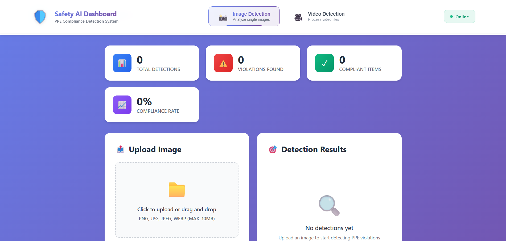
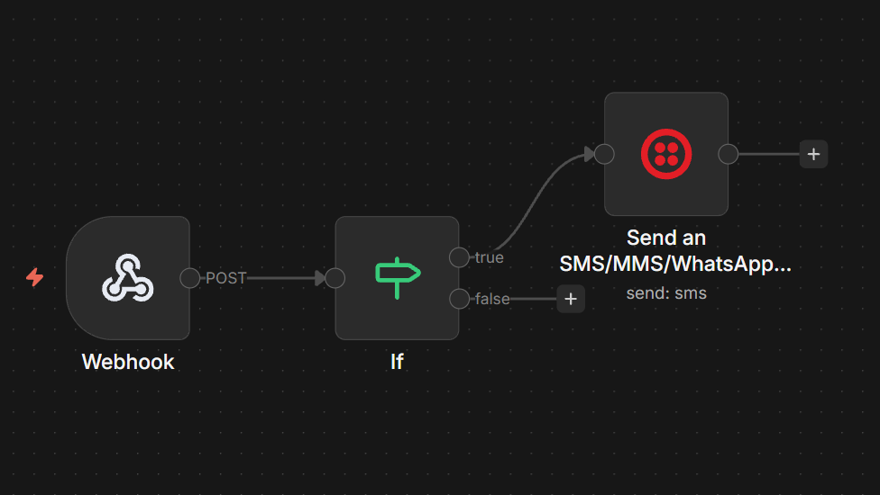

# 🛡️ Safety AI Dashboard

### PPE Compliance Detection System (Image & Video AI Detection)

------------------------------------------------------------------------

## 📌 Project Overview

Safety AI Dashboard is a full-stack AI-powered web application designed
to detect Personal Protective Equipment (PPE) compliance violations from
images and videos.



The system uses computer vision models (YOLO / Ultralytics) to identify
safety violations such as:

-   Missing Helmet
-   Missing Safety Vest
-   Missing Mask
-   Other configurable PPE rules

The dashboard provides real-time detection results, violation
statistics, compliance calculation, and a clean professional interface.


------------------------------------------------------------------------

## 🚀 Features

### 📷 Image Detection

-   Upload PNG, JPG, JPEG, WEBP (max 10MB)
-   Detect PPE violations
-   Displays:
    -   Total Detections
    -   Violations Found
    -   Compliant Items
    -   Compliance Rate
-   Annotated detection results

### 🎥 Video Detection

-   Upload MP4, AVI, MOV, WEBM (max 100MB)
-   Frame-by-frame processing
-   Displays:
    -   Frames Processed
    -   Violations Found
    -   Compliant Items
    -   FPS Processed

------------------------------------------------------------------------
## Model

- This Image and Video detection model was trained in  ``yoloV8``
-  The number of epochs = 20
- The batach size = 32

------------------------------------------------------------------------

## Dataset
- The dataset was takes from the [roboflow](https://universe.roboflow.com/custom-model/construction-safety-nvqbd) website.
- The dataset consisted over **2500+** annotated images
- There was more than 10 classes in the dataset 

------------------------------------------------------------------------

## 🏗️ System Architecture & Tech Stack
Built with ``React`` and ``FastAPI``, this system automates PPE compliance monitoring through a high-performance pipeline.

### 🛠️ Tech Stack & Automation
- **Frontend Interface:** Developed with ``React`` providing a high-performance, responsive dashboard for real-time visualization of compliance metrics and annotated media.

- **Core Engine:** ``FastAPI`` handles asynchronous requests and coordinates the ``YOLO (Ultralytics)`` model for real-time detection of helmets, vests, and masks.

- **Data Persistence:** A ``PostgreSQL`` database serves as the central audit log, storing timestamps and violation metadata for historical compliance tracking.

- **Intelligent Notifications:** ``n8n`` manages automated workflows, triggering immediate SMS alerts to safety officers when critical violations are identified.

- **Infrastructure:** Fully containerized using ``Docker`` for streamlined deployment to ``AWS`` or ``Render``.

### 🔄 Integrated Data & Logic Flow
The system operates through a strictly defined data pipeline to ensure low latency and high reliability:

- **Ingestion:** User uploads are handled by the ``React`` frontend and transmitted via the ``Fetch API`` to the ``FastAPI`` gateway.

- **Inference:** The backend triggers the ``YOLO`` (Ultralytics) model to perform object detection for **PPE compliance (Helmets, Vests, Masks)**.

- **Persistence (The "Log" Phase):** If a violation is detected, the API immediately executes a write operation to the ``PostgreSQL`` database, recording the event **timestamp and metadata**.

- **Automation (The "Alert" Phase):** The database entry triggers an ``n8n`` webhook. ``n8n`` then processes the logic and transmits an immediate ``SMS notification`` to designated safety personnel.

- **Visualization:** The results are returned to the ``React`` dashboard, updating the ``compliance rate`` and ``detection`` statistics in real-time.

**Explore the Deep Dive:** For a comprehensive breakdown of the infrastructure, please checkout [System Architecture With Diagram](https://system-architecture.onrender.com/)

------------------------------------------------------------------------

# ⚙️ Installation & Setup

## 1️⃣ Clone Repository

```
git clone https://github.com/your-username/safety-ai.git
```
Get into the root directory
```
cd safety-ai
```
------------------------------------------------------------------------

## 2️⃣ Run With Docker (Recommended)
```
docker-compose up --build
```
Run in background:
```
docker-compose up -d --build
```
### Access:

#### Frontend
```
http://localhost:3000
```
#### Backend

```
http://localhost:8001/docs
```
------------------------------------------------------------------------

## 3️⃣ Run Without Docker

### Backend
1. First open ``cmd prompt`` in the directory
2. Navigate to backend directory. 
```
cd backend-api
```
3. Create a virtual environment in Python
```
python -m venv venv
```
4. Activate the virtual environment
```
venv/bin/activate
```
5. Intall all the modules by using ``pip`` in the ``cmd``.
```
pip install -r requirements.txt
```
6. Run the ``FastApi`` server in ``PORT 8001``.
```
uvicorn main:app --reload --port 8001
```
Backend runs at: http://localhost:8001

### Frontend
To run the frontend revert back to the root directory
1. Open a new tab in ``CMD`` prompt
2. Navigate to the frontend directory
```
cd frontend
```
3. Install all the node modules file
```
npm install
```
4. Run the React server
```
npm start
```
Frontend runs at: http://localhost:3000

------------------------------------------------------------------------
# 🔄 CI/CD
## 📌 Overview

This project uses GitHub Actions to implement Continuous Integration (CI) for both the backend and frontend services.

The pipeline automatically runs whenever:

- Code is pushed to the main branch

- A Pull Request is opened targeting the main branch

This ensures:

- Backend code integrity

- Successful frontend builds

- Automated validation before deployment

- Stable production releases

## 🧠 Backend CI Pipeline
The backend is built using FastAPI (Python 3.11) and is automatically tested through GitHub Actions.

### 📁 Workflow File Location
```
.github/workflows/backend-ci.yml
```
### ⚙️ Backend CI Configuration
```
name: Backend CI

on:
  push:
    branches: ["main"]
  pull_request:
    branches: ["main"]

jobs:
  backend-ci:
    runs-on: ubuntu-latest

    steps:
      - name: Checkout repo
        uses: actions/checkout@v4

      - name: Setup Python
        uses: actions/setup-python@v5
        with:
          python-version: "3.11"

      - name: Install dependencies
        run: |
          cd backend-api
          python -m pip install --upgrade pip
          pip install -r requirements.txt
          
      - name: Check app imports (FastAPI sanity check)
        run: |
          cd backend-api
          python -c "import main; print('Backend imports OK')"
      - name: Run Tests
        run: |
          cd backend-api
          pytest

```
## 🎨 Frontend CI Pipeline
The frontend is built using React (Node.js 20) and validated using GitHub Actions.

### 📁 Workflow File Location
```
.github/workflows/backend-ci.yml
```
### ⚙️ Frontend CI Configuration
```
name: Frontend CI

on:
  push:
    branches: ["main"]
  pull_request:
    branches: ["main"]

jobs:
  frontend-ci:
    runs-on: ubuntu-latest

    steps:
      - name: Checkout repo
        uses: actions/checkout@v4

      - name: Setup Node
        uses: actions/setup-node@v4
        with:
          node-version: "20"

      - name: Install and build React app
        run: |
          cd frontend
          npm install
          npm run build

```
------------------------------------------------------------------------

# 🌍 Deployment

## 🚀 Deploy on Render

1.  Push code to GitHub
2.  Create Web Service for backend
3.  Build Command:
```
pip install -r requirements.txt
```
4.  Start Command:
```
uvicorn main:app --host 0.0.0.0 --port 10000
```

------------------------------------------------------------------------

## ☁️ Deploy on AWS EC2

1.  Launch Ubuntu EC2
2.  Open ports 22, 3000, 8000
3.  Install Docker:

```
sudo apt update
sudo apt install docker.io docker-compose -y
```
4.  Clone project
5.  Run:
```
docker-compose up -d --build
```
------------------------------------------------------------------------
# 🧪 Testing
We used ``pytest`` alongside ``FastAPI.testclient`` to validate the API's core functionality and logic.
## 🌐 1. Core API Tests
These tests verify that the server is alive and that the AI detection endpoint handles file uploads correctly.

```
from fastapi.testclient import TestClient
from main import app
import pytest

client = TestClient(app)

# Test 1: System Health Check
def test_health():
    response = client.get("/health")
    assert response.status_code == 200
    assert response.json() == {"status": "ok"}
```

## 🔍 2. Logic Testing
These test verify if that the detection is logging events in the database and triggering the ``n8n`` to send notification
```
from logic import decide_event

def test_no_hardhat_violation():
    event_type, severity = decide_event(["Person", "NO-Hardhat"])
    assert event_type == "PPE_VIOLATION"
    assert severity == "HIGH"

def test_no_vest_violation():
    event_type, severity = decide_event(["Person", "NO-Safety Vest"])
    assert event_type == "PPE_VIOLATION"
    assert severity == "HIGH"

def test_normal_case():
    event_type, severity = decide_event(["Person", "Hardhat"])
    assert event_type == "Normal"
    assert severity == "LOW"

```
### 🔄 Running Tests
To run all tests and see the pass/fail results in your terminal:
```
pytest
```
------------------------------------------------------------------------

# 🧩 n8n Workflow
## 📌 Overview

This project integrates n8n for workflow automation. The automation is responsible for:

  1. Receiving detection results from backend

  2. Processing alert logic

  3. Sending SMS notifications




------------------------------------------------------------------------
# 📊 Detection Workflow

## Image Flow

1.  User uploads image
2.  Backend processes via OpenCV
3.  YOLO model detects PPE
4.  Violations calculated
5.  Results returned

## Video Flow

1.  User uploads video
2.  Frames extracted
3.  Each frame processed
4.  Violations aggregated
5.  Compliance calculated

------------------------------------------------------------------------

# 📈 Compliance Calculation

```
Compliance Rate = (Compliant Items / Total Detected Items) × 100
```

------------------------------------------------------------------------

# 🧪 API Endpoints

## POST /detect-image


```
{
  "total_detections": 5,
  "violations": 2,
  "compliant": 3,
  "compliance_rate": 60.0,
  "detections": [
    { "class": "no-helmet", "confidence": 0.92, "bbox": [10, 20, 50, 80] },
    { "class": "vest", "confidence": 0.88, "bbox": [15, 25, 55, 85] }
  ]
  "frame": 1
}
```

## POST /detect-video

```
[
  {
    "total_detections": 5,
    "violations": 2,
    "compliant": 3,
    "compliance_rate": 60.0,
    "detections": [
      { "class": "no-helmet", "confidence": 0.92, "bbox": [10, 20, 50, 80] },
      { "class": "vest", "confidence": 0.88, "bbox": [15, 25, 55, 85] }
    ]
    "frame": 2
  },
  {
    "total_detections": 5,
    "violations": 2,
    "compliant": 3,
    "compliance_rate": 60.0,
    "detections": [
      { "class": "no-helmet", "confidence": 0.92, "bbox": [10, 20, 50, 80] },
      { "class": "vest", "confidence": 0.88, "bbox": [15, 25, 55, 85] }
    ]
    "frame": 4
  }
]
```
------------------------------------------------------------------------

# 🔒 Security

-   File type validation
-   File size limits
-   CORS enabled
-   Containerized backend

------------------------------------------------------------------------

# 🧑‍💻 Future Improvements

-   Real-time camera streaming
-   WebSocket support
-   User authentication
-   Cloud storage integration
-   GPU acceleration

------------------------------------------------------------------------

# 📦 Requirements

-   Python 3.10+
-   Node 18+
-   Docker (optional)
-   8GB RAM minimum
-   GPU (optional)

------------------------------------------------------------------------

# 👨‍💻 Author

Author Name: MD Moshiur Rahman


------------------------------------------------------------------------

# 📄 License

MIT License

------------------------------------------------------------------------

⭐ Full-stack AI system with production-ready deployment.
